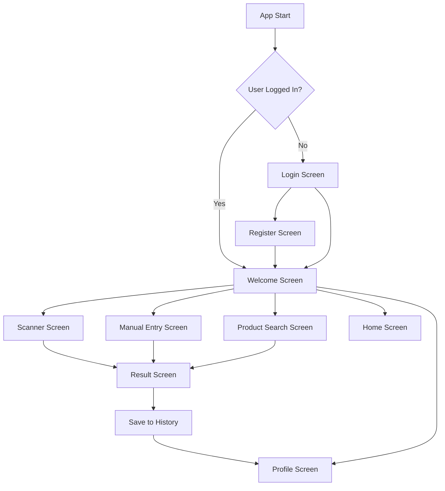
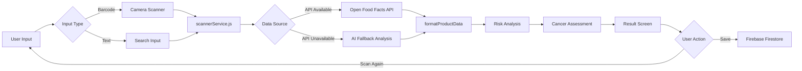

# FoodRisk-App: AI-Powered Food Health Analysis Application

## 📋 Project Overview

**FoodRisk-App** is a cross-platform mobile application built with React Native and Expo that leverages AI and real-time data APIs to analyze food products and provide health risk assessments. The app helps users make informed dietary decisions by scanning product barcodes or searching by name to receive instant nutritional analysis, allergen warnings, and health risk evaluations.

---

## 🎯 Key Features

### 1. **User Authentication System**
- Secure Firebase Authentication with email/password
- Persistent login sessions across app restarts
- User-specific data storage and retrieval

### 2. **Barcode Scanner**
- Real-time QR/barcode scanning using device camera
- Instant product recognition and analysis
- Support for international product databases

### 3. **AI-Powered Product Search**
- Text-based product search functionality
- Integration with Open Food Facts API (world's largest open food database)
- Intelligent fallback AI analysis when API data is unavailable

### 4. **Comprehensive Health Analysis**
- **Nutritional Scoring**: 0-100 health score based on multiple factors
- **Allergen Detection**: Identifies common allergens (nuts, dairy, soy, etc.)
- **Risk Assessment**: Analyzes sugar, fat, salt, and additive content
- **Cancer Risk Evaluation**: Flags ingredients linked to health concerns
- **Detailed Nutrition Facts**: Calories, protein, carbs, fat, sugar, salt per 100g

### 5. **Personal History**
- Save analyzed products to personal history
- Cloud-based storage using Firebase Firestore
- View and manage saved products from profile screen

### 6. **Cross-Platform Support**
- Works on iOS, Android, and Web
- Responsive design optimized for mobile devices
- Native performance with React Native

---

## 🤖 How AI is Integrated

### 1. **Open Food Facts API Integration**
The app uses the **Open Food Facts API**, which contains data on millions of food products worldwide:

```javascript
// Real-time API call to search for products
const response = await fetch(
  `https://world.openfoodfacts.org/cgi/search.pl?search_terms=${productName}&json=1`
);
```

**What the API provides:**
- Product names and brands
- Complete ingredient lists
- Nutritional information (calories, macros, micronutrients)
- Allergen tags
- Additive information
- Nutri-Score grades (A-E rating system)

### 2. **Intelligent Scoring Algorithm**
The app uses an **AI-powered scoring system** that evaluates products on a 0-100 scale:

```javascript
const calculateScore = (product) => {
  let score = 100;
  const nutrients = product.nutriments || {};
  
  // Deduct points based on unhealthy factors
  if (nutrients['sugars_100g'] > 15) score -= 20;      // High sugar penalty
  if (nutrients['fat_100g'] > 20) score -= 15;         // High fat penalty
  if (nutrients['salt_100g'] > 1) score -= 10;         // High sodium penalty
  if (nutrients['energy-kcal_100g'] > 300) score -= 10; // High calorie penalty
  
  return Math.max(10, score);
};
```

**Scoring Interpretation:**
- 🟢 **70-100**: Healthy choice
- 🟡 **40-69**: Moderate health profile
- 🔴 **0-39**: Unhealthy, consume sparingly

### 3. **Risk Identification AI**
The app analyzes ingredients and nutritional data to identify specific health risks:

```javascript
const identifyRisks = (product, nutrition) => {
  const risks = [];
  
  // Sugar analysis
  if (parseFloat(nutrition.sugar) > 15) {
    risks.push(`High sugar content (${nutrition.sugar}g per 100g)`);
  }
  
  // Fat analysis
  if (parseFloat(nutrition.fat) > 20) {
    risks.push(`High fat content (${nutrition.fat}g per 100g)`);
  }
  
  // Additive detection
  const additives = product.additives_tags || [];
  if (additives.length > 0) {
    risks.push(`Contains ${additives.length} additives/preservatives`);
  }
  
  // Ingredient analysis
  if (product.ingredients_text?.toLowerCase().includes('palm oil')) {
    risks.push('Contains palm oil');
  }
  
  return risks;
};
```

### 4. **Cancer Risk Assessment**
Advanced analysis of ingredients linked to cancer research:

```javascript
const assessCancerRisk = (product, nutrition) => {
  // Check for nitrites/nitrates (common in processed meats)
  if (product.ingredients_text?.toLowerCase().includes('nitrite') ||
      product.ingredients_text?.toLowerCase().includes('nitrate')) {
    return 'Moderate (contains preservatives)';
  }
  
  // High sugar correlation
  if (parseFloat(nutrition.sugar) > 20) {
    return 'Low (high sugar may increase cancer risk indirectly)';
  }
  
  // Multiple additives
  if (product.additives_tags?.length > 5) {
    return 'Low (multiple additives)';
  }
  
  return 'Not classified';
};
```

### 5. **Fallback AI Analysis**
When API data is unavailable, the app uses **keyword-based AI analysis**:

```javascript
const generateAIAnalysis = (productName) => {
  const lower = productName.toLowerCase();
  let score = 50;
  const risks = [];
  
  // Pattern matching for product categories
  if (lower.includes('soda') || lower.includes('cola')) {
    score = 20;
    risks.push('High sugar content', 'Caffeine', 'Artificial sweeteners');
  } else if (lower.includes('vegetable') || lower.includes('fruit')) {
    score = 85;
    risks.push('No significant risks');
  }
  
  return { product: productName, score, risks, ... };
};
```

---

## 🏗️ Technical Architecture

### **Technology Stack**

| Component | Technology | Purpose |
|-----------|-----------|---------|
| **Frontend Framework** | React Native 0.81.5 | Cross-platform mobile development |
| **Development Platform** | Expo ~54.0.31 | Simplified build and deployment |
| **Navigation** | React Navigation 7.x | Screen navigation and routing |
| **Backend/Database** | Firebase (Firestore + Auth) | User authentication and data storage |
| **State Management** | React Hooks (useState, useEffect) | Component state management |
| **API Integration** | Open Food Facts API | Product data retrieval |
| **Camera/Scanner** | expo-barcode-scanner | Barcode/QR code scanning |
| **Storage** | AsyncStorage | Local data persistence |

### **Project Structure**

```
FoodRisk-App/
├── src/
│   ├── components/          # Reusable UI components
│   │   ├── Button.js        # Custom button component
│   │   ├── Card.js          # Card layout component
│   │   ├── CopyableText.js  # Text with copy functionality
│   │   ├── Header.js        # App header component
│   │   └── ScannerView.js   # Camera scanner component
│   │
│   ├── screens/             # Application screens
│   │   ├── WelcomeScreen.js       # Main menu
│   │   ├── LoginScreen.js         # User login
│   │   ├── RegisterScreen.js      # User registration
│   │   ├── ScannerScreen.js       # Barcode scanner
│   │   ├── ManualEntryScreen.js   # Manual product entry
│   │   ├── ProductSearchScreen.js # Search by name
│   │   ├── ResultScreen.js        # Analysis results display
│   │   ├── HomeScreen.js          # User dashboard
│   │   └── ProfileScreen.js       # Saved products history
│   │
│   ├── services/            # Business logic and API calls
│   │   ├── scannerService.js  # Product analysis logic
│   │   └── foodService.js     # Firebase CRUD operations
│   │
│   ├── navigation/          # Navigation configuration
│   │   └── RootNavigator.js   # App routing logic
│   │
│   └── config/              # Configuration files
│       └── firebaseConfig.js  # Firebase initialization
│
├── assets/                  # Images and icons
├── App.js                   # App entry point
├── app.json                 # Expo configuration
└── package.json             # Dependencies
```

### **Navigation Flow**



### **Data Flow Architecture**



---

## 🔥 Firebase Integration

### **Authentication**
```javascript
// Platform-specific persistence
const auth = initializeAuth(app, {
  persistence: Platform.OS === 'web'
    ? [indexedDBLocalPersistence, browserLocalPersistence]
    : getReactNativePersistence(ReactNativeAsyncStorage)
});
```

### **Firestore Database Structure**
```
firestore/
└── users/
    └── {userId}/
        └── foods/
            └── {foodId}/
                ├── product: "Product Name"
                ├── score: 75
                ├── allergens: ["Milk", "Soy"]
                ├── risks: ["High sugar"]
                ├── nutritionInfo: {...}
                ├── cancerRisk: "Not classified"
                └── createdAt: timestamp
```

### **CRUD Operations**
```javascript
// Save product to user's history
export const addFood = async (foodData) => {
  const user = auth.currentUser;
  const foodsRef = collection(db, `users/${user.uid}/foods`);
  await addDoc(foodsRef, {
    ...foodData,
    createdAt: serverTimestamp(),
  });
};

// Retrieve user's saved products
export const getFoods = async () => {
  const user = auth.currentUser;
  const foodsRef = collection(db, `users/${user.uid}/foods`);
  const q = query(foodsRef, orderBy("createdAt", "desc"));
  const querySnapshot = await getDocs(q);
  return querySnapshot.docs.map(doc => ({ id: doc.id, ...doc.data() }));
};
```

---

## 📊 Example Analysis Output

### **Sample Product: Nutella 400g**

**Input:** Barcode scan or search "Nutella"

**AI Analysis Output:**
```json
{
  "product": "Nutella 400g",
  "score": 38,
  "allergens": ["Hazelnuts", "Milk", "Soy"],
  "nutritionInfo": {
    "calories": 539,
    "protein": 6.3,
    "carbs": 57.5,
    "fat": 30.9,
    "sugar": 56.3,
    "salt": 0.107
  },
  "risks": [
    "Very high sugar content (56.3g per 100g)",
    "High fat content (30.9g per 100g)",
    "Contains palm oil",
    "Contains 2 additives/preservatives"
  ],
  "cancerRisk": "Moderate (palm oil)",
  "ingredients": "Sugar, Palm Oil, Hazelnuts (13%), Skimmed Milk Powder...",
  "source": "Open Food Facts Database"
}
```

**Visual Display:**
- 🔴 **38/100** (Red score - unhealthy)
- ⚠️ **Allergens**: Hazelnuts • Milk • Soy
- 📊 **Nutrition per 100g**: 539 kcal, 56.3g sugar, 30.9g fat
- ⚠️ **Health Risks**: Very high sugar, Palm oil, Additives
- 🧬 **Cancer Risk**: Moderate (palm oil)

---

## 🚀 How to Run the Project

### **Prerequisites**
- Node.js (v16 or higher)
- npm or yarn
- Expo CLI
- iOS Simulator / Android Emulator / Physical device with Expo Go app

### **Installation Steps**

1. **Navigate to the app directory:**
   ```bash
   cd FoodRisk-App
   ```

2. **Install dependencies:**
   ```bash
   npm install
   ```

3. **Start the development server:**
   ```bash
   npm start
   ```

4. **Run on specific platform:**
   ```bash
   npm run android   # For Android
   npm run ios       # For iOS
   npm run web       # For Web browser
   ```

5. **Scan QR code** with Expo Go app (mobile) or press `w` for web

---

## 🎓 Academic Significance

### **Learning Outcomes Demonstrated**

1. **Mobile Development**: Cross-platform app development with React Native
2. **API Integration**: Real-time data fetching from external APIs
3. **AI/ML Concepts**: Scoring algorithms, pattern matching, risk assessment
4. **Database Management**: Cloud-based NoSQL database (Firestore)
5. **User Authentication**: Secure login/registration system
6. **State Management**: React hooks and component lifecycle
7. **UI/UX Design**: Intuitive interface with visual feedback
8. **Data Analysis**: Nutritional data interpretation and health risk evaluation

### **Real-World Applications**

- **Health & Wellness**: Helps users make informed dietary choices
- **Allergen Management**: Critical for people with food allergies
- **Nutrition Education**: Teaches users about food composition
- **Public Health**: Contributes to obesity and disease prevention
- **Consumer Awareness**: Empowers informed purchasing decisions

---

## 🔮 Future Enhancements

1. **Machine Learning Integration**: Train custom ML models for better predictions
2. **Image Recognition**: Scan product images instead of just barcodes
3. **Personalized Recommendations**: AI-based suggestions based on user health goals
4. **Social Features**: Share products and reviews with friends
5. **Offline Mode**: Cache API data for offline analysis
6. **Multi-language Support**: Internationalization for global users
7. **Dietary Filters**: Vegan, Keto, Halal, Kosher filtering
8. **Health Tracking**: Monitor daily nutrition intake

---

## 📝 Conclusion

FoodRisk-App demonstrates the practical application of AI and modern mobile development technologies to solve real-world health problems. By combining barcode scanning, API integration, intelligent algorithms, and cloud storage, the app provides users with instant, actionable health insights about their food choices.

The project showcases proficiency in:
- React Native mobile development
- Firebase backend services
- RESTful API integration
- AI-powered data analysis
- User experience design
- Cross-platform deployment

This application serves as both a functional health tool and a comprehensive demonstration of modern software development practices.

---

## 👨‍💻 Developer Information

**Project Name**: FoodRisk-App  
**Platform**: React Native + Expo  
**Database**: Firebase (Firestore + Authentication)  
**API**: Open Food Facts  
**Version**: 1.0.0  
**Bundle ID**: com.maldino23.FoodRiskApp  

---

## 📚 References

- [React Native Documentation](https://reactnative.dev/)
- [Expo Documentation](https://docs.expo.dev/)
- [Firebase Documentation](https://firebase.google.com/docs)
- [Open Food Facts API](https://world.openfoodfacts.org/data)
- [React Navigation](https://reactnavigation.org/)
- [Nutri-Score System](https://en.wikipedia.org/wiki/Nutri-Score)
